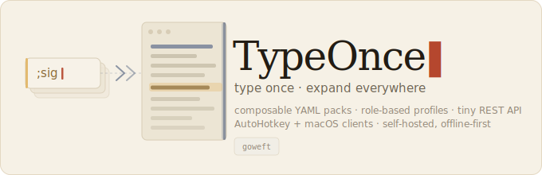
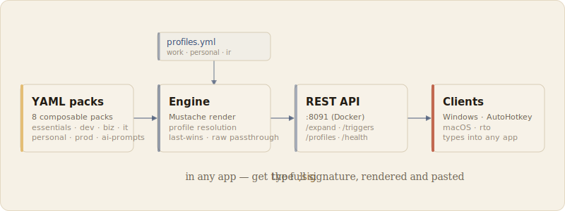

<p align="center"></p>

# TypeOnce

**Type a short trigger, get the full text — everywhere you type.**

TypeOnce is a self-hosted text-expansion engine. You define snippets as composable
YAML packs, and a tiny REST API expands a trigger like `;sig` into a full signature,
a ticket reply, a git command, or any boilerplate you type all day. Role-based
profiles let the same trigger resolve differently per context, and lightweight
clients wire it into Windows and macOS so expansion happens in any app.

It runs on your own machine in Docker — your snippets never leave it.

---

## How it works

<p align="center"></p>

Packs are loaded into an engine that renders templates (Mustache, plus built-in
variables like `{{date}}`), resolves which pack wins for a given trigger under the
active profile, and serves the result over a small HTTP API. Desktop clients call
`/expand` and type the result back into whatever app is focused.

## Packs

A pack is a YAML file: an `id`, some `vars`, and a list of triggers. A trigger maps a
key to a template.

```yaml
id: "typeonce.essentials"
name: "Essential Snippets"
version: "0.1.0"
vars:
  email: "you@example.com"
triggers:
  - key: ";sig"
    label: "Email signature"
    action:
      type: "text"
      template: |
        Best regards,
        {{user}}
        {{vars.email}}

  - key: ";date"
    label: "Today's date"
    action:
      type: "text"
      template: "{{date}}"

  - key: ";docker"
    label: "List containers"
    action:
      type: "text"
      raw: true          # pass the template through verbatim — no templating, no escaping
      template: "docker ps --format 'table {{.Names}}\t{{.Status}}'"
```

`raw: true` skips templating and HTML-escaping, so Go-template format strings, shell
snippets, and anything containing `{{ }}` survive intact.

## Profiles

Profiles scope which packs are active, so one key can resolve differently per
context — and cross-pack collisions (e.g. `;sig` defined in both a business and a
personal pack) resolve cleanly instead of silently shadowing one another.

```yaml
# data/profiles.yml
default: work
profiles:
  work:     { packs: [biz.communication, it.support, dev.toolkit, prod.shortcuts, ai.prompts] }
  personal: { packs: [personal.quick, custom.personal, typeonce.essentials, ai.prompts] }
  ir:       { packs: [it.support, dev.toolkit, ai.prompts] }
```

With no profile active, all packs are eligible and behavior is the plain last-wins
default — fully backward compatible. A profile can be set at boot (`PROFILE=work`),
persisted via the CLI, or passed per request.

## API

| Method | Route | Purpose |
|---|---|---|
| `GET`  | `/health`   | status, trigger count, active profile |
| `GET`  | `/triggers` | list triggers (filtered by the active profile) |
| `GET`  | `/profiles` | list profiles |
| `POST` | `/expand`   | `{ "trigger": ";sig", "profile": "work" }` → `{ "success": true, "result": "..." }` |

## Quickstart

```bash
# build + run the API (Docker)
docker compose up -d --build

# expand a trigger
curl -s localhost:8091/expand -H 'Content-Type: application/json' \
  -d '{"trigger":";sig"}'
```

Or run the CLI directly:

```bash
npm install
node cli/index.js expand ';sig'
node cli/index.js profile use work
node cli/index.js validate
```

## Clients

- **Windows** — a PowerShell script generates an AutoHotkey v2 script from the live
  `/triggers`, turning every trigger into a hotstring that calls the API and types
  the result.
- **macOS** — a small shell function (`rto`) posts to `/expand` and pastes the
  result with a native notification.

Regenerate the client whenever your trigger set changes (for example, after switching
the boot profile).

## Configuration

| Env | Default | Meaning |
|---|---|---|
| `API_PORT` | `8090` | port the server listens on (mapped to `8091` on the host by compose) |
| `PACK_DIR` | `./packs` | directory of pack YAML files |
| `PROFILES_FILE` | `<packDir>/../profiles.yml` | profiles definition |
| `PROFILE` | _(unset)_ | boot profile; unset means all packs are eligible |

## Tests

```bash
npm test
```

Jest covers template rendering, the `raw` passthrough, cross-pack dedup, and
profile-scoped resolution. CI runs the suite on every push and pull request.

## License

MIT.
